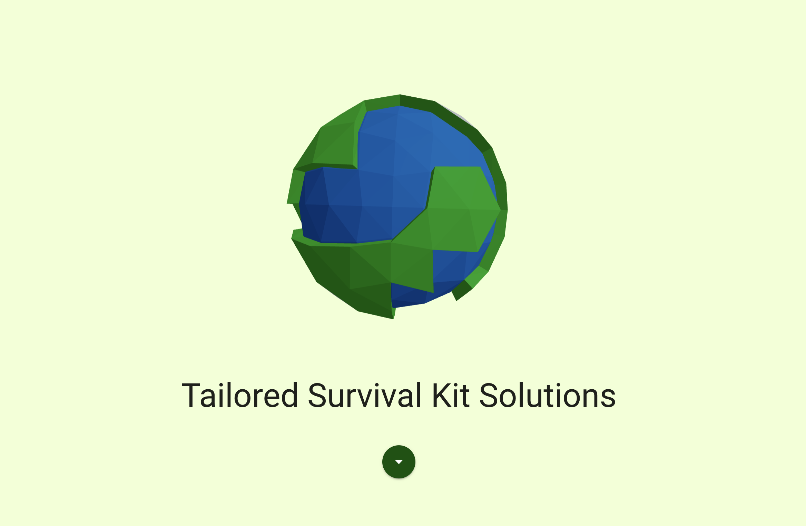

# PrepPal: RAG-Assisted Disaster Preparation

PrepPal is a disaster preparedness assistant that utilizes Retrieval-Augmented Generation (RAG) to provide tailored guidance for various natural disasters. By leveraging advanced AI models, PrepPal delivers actionable advice to help individuals and communities prepare for emergencies like hurricanes, earthquakes, floods, and more.

## Installation

Clone the repository:

```bash
git clone https://github.com/yourusername/preppal.git
cd preppal
```

Install the required Python packages:

```bash
pip install -r requirements.txt
```

## Usage

1. **Build the Docker Image**  
   From the project root:

   ```bash
   docker build -t preppal .
   ```

2. **Run the Container**

   ```bash
   docker run -d -p 80:80 --name preppal-container preppal
   ```

3. **Test the `answer` Endpoint**

   ```bash
   curl -X POST http://127.0.0.1/api/answer        -H "Content-Type: application/json"        -d '{"query": "What should I do to prepare for a hurricane?"}'
   ```

   **Expected Response:**

   ```json
   {
     "answer": "• Plan for your entire household including children, people with disabilities and access and functional needs, and pets.\n• Keep your gas tank at least half-full at all times.\n• Maintain basic emergency supplies (e.g., snacks, bottled water, first aid kit, flashlight, flares, jumper cables and other tools, a wool blanket, and a change of clothes) in your vehicle.\n• Pick an out-of-state contact everyone can call to check-in and report their status.",
     "documents": ["fema_effak-toolkit", "CPG_101_V2_30NOV2010_FINAL_508", "fema_2023-npr"]
   }
   ```

## Contributing

Pull requests are welcome. For major changes, please open an issue first to discuss what you would like to change.

Please make sure to update tests as appropriate.


## Gallery

### User Interface




*Image paths:*

- `assets/earth.png`
- `assets/earth.png`
- `assets/earth.png`
- `assets/earth.png`
